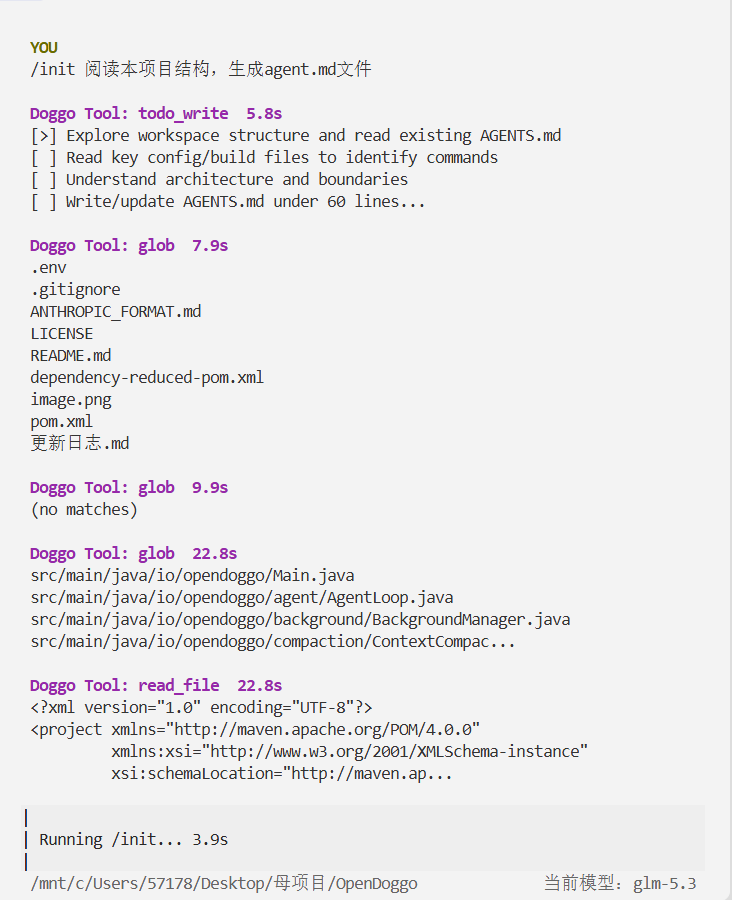

# OpenDoggo

  

**仓库地址**：https://github.com/Lixy-Evenfish/OpenDoggo.git

**一个开源 AI coding agent**，以提供工具的方法，协助支持 Anthropic Message 格式的 LLM 读写本地文件、执行命令、获取上下文，直到任务完成。本 Agent 实现了对话历史与上下文管理、工具的定义与本地执行等常见功能并拓展了进阶功能。模型客户端零 AI SDK 依赖（仅 JDK `HttpClient` 实现），适合用来拆解一个 coding agent 的内部机制。



## 功能全景

11 个内置工具、40 个 Java 文件、约 6,900 行代码，按子系统分层：

### Agent 主体循环

- **Agent Loop 主循环** — 协助 LLM 模型调用本地工具，LLM调用后把结果回灌进对话继续循环，不再有工具调用请求就敲定最终回答；单轮失败也能回滚历史，避免残留消息污染。
- **工具注册制** — 实现统一的工具接口 + 工具注册方法，新增的工具遵循范式就可接入。
- **Hooks 循环钩子** — 在 用户输入后 / 工具使用前 / 工具使用后 / 循环退出前 四个位置设挂载点，使得新增工具时主体循环基本不改动。

### 工具与优化

- **四级上下文压缩管线** — 实现大结果落盘、消息归档、旧结果缩短、调用 API 生成摘要四级压缩策略。
- **SubAgent 任务委派** — 实现 `task` 工具允许 LLM 把独立子任务派给子代理执行，保持上下文干净。
- **TodoWrite 计划机制** — 多步任务中引导模型显式维护任务清单，防止中途跑偏。
- **Skill 按需加载** — 技能目录常驻 system prompt，正文按需取回，控制输入 token。
- **慢任务放后台** — 命令转后台执行，后续轮次收集结果。

### 安全与隔离

- **权限三道闸门** — 硬拒绝表、规则匹配、用户审批浮层依次过滤每次工具调用。
- **Docker 代码沙箱** — 实现`run_code`工具 在一次性容器执行不受信任代码。

### 终端交互

- **全屏 TUI** — 迎宾页 + 滚动对话页 + 审批浮层，多轮历史驻留
- **反斜杠命令** — 目前仅支持 `/init` 一键生成 agent.md

## 开发历程

| 版本 | 目标 | 关键产出 |
|------|------|----------|
| v1 | 跑通核心闭环 | agent loop、五个基础工具、权限三道闸门 |
| v2 | 稳定内核、机制扩展 | hooks、TodoWrite、SubAgent、Skill |
| v3 | 进阶能力 | 四级上下文压缩、MCP 接入、慢任务后台、Docker 沙箱 |
| v4 | 交互体验 | 全屏 TUI、反斜杠命令 |

## 快速开始

### 环境要求

- **JDK 17+、Maven** — 必需
- **Docker** — 可选，仅 `run_code` 代码沙箱需要；缺失时该工具返回错误提示，其余功能不受影响（镜像准备见 [run_code](#run_code)）

### 1. 配置模型端点

项目根目录建 `.env`：

```
ANTHROPIC_BASE_URL=https://open.bigmodel.cn/api/anthropic
MODEL_ID=glm-5.3
```

API key 走环境变量，**不要写进 `.env`, 有泄露可能**：

```bash
read -rsp "key: " ANTHROPIC_API_KEY && export ANTHROPIC_API_KEY && echo
```

### 2. 构建并启动

```bash
mvn package
java -jar target/opendoggo-0.1.0-SNAPSHOT.jar
```

`.env` 的优先级高于环境变量（对齐 s1 的 `load_dotenv(override=True)`），所以 `.env` 里写了同名项会把环境变量顶掉。


### 可用模型

客户端只说 Anthropic Messages 协议，因此**任何支持 Anthropic 格式的模型**都可以接入——官方 Claude 系列，以及各厂商提供的 Anthropic 兼容端点均可。


## 添加技能

```text
skills/
  my-skill/SKILL.md        ← 一个技能 = 一级子目录 + 固定文件名 SKILL.md
```

`skills/`、`SKILL.md` 文件名、一层深度固定；子目录名自定，缺省作技能名。

`SKILL.md` 顶部是可选的 frontmatter（两行 `---` 包住），正文为任意 Markdown：

```markdown
---
name: my-skill
description: 什么时候用这个技能——目录里唯一的触发依据，写"何时用"而非"是什么"
---
```

## 许可

见 [LICENSE](LICENSE)。
